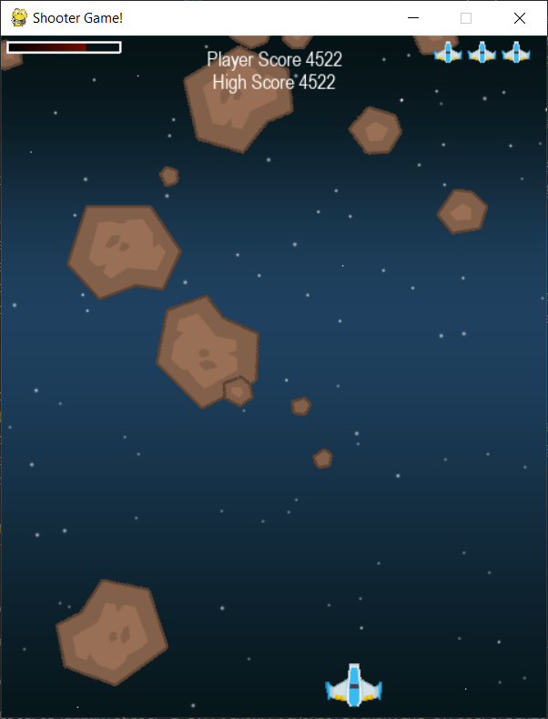
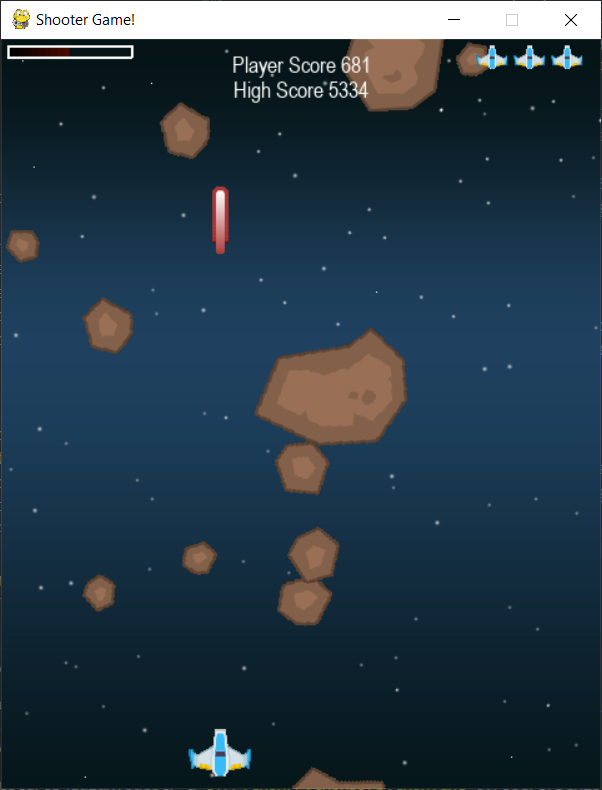
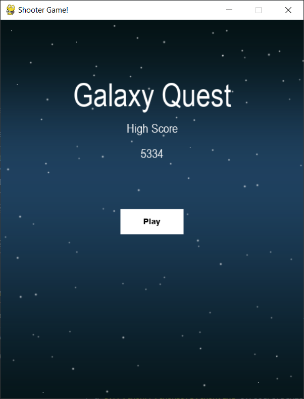

# galaxyQuest

What the program can do
  - The game must be implemented using a game platform.

  - The game should have either an entertainment or education purpose.

  - The game should display graphics, take user input, and have moveable objects.

  - The program can also filter through a collection of names
  - other ideas maybe added such as matching courses from one row with courses in another row

# COMMANDS USED
pygame video game. This is a space shooter video game.

# PROGRAMMING SOFTWARE USED
Pygame

# Decription
This game was made with some help from youtube, I added Different features in the game to make game look better.

Try to Stay alive as you navigate the rough terrains. Through space this is an infinite game. So,
try your best to survive. And try to beat your own score.
# SOURCES
<ul>
  <li>www.w3schools.com</li>
  <li>www.youtube.com</li>
  <li>www.stackoverflow.com</li>
</ul>

# IMAGE OF SOFTWARE TEST

